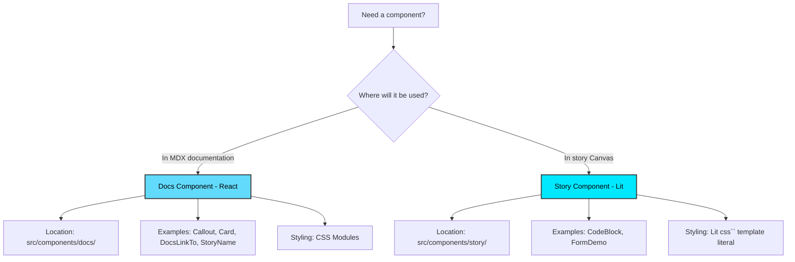

# Boreal Component Library - Documentation Application

Storybook-based documentation system for the Boreal Component Library by Proximus Group

## Table of Contents

- [Overview](#overview)
- [Getting Started](#getting-started)
- [Project Structure](#project-structure)
- [Story Generation System](#story-generation-system)
- [Component System](#component-system)
- [Hooks](#hooks)
- [Writing Documentation](#writing-documentation)
- [Type System](#type-system)
- [Utilities](#utilities)
- [Development](#development-1)
- [Best Practices](#best-practices)
- [Contributing](#contributing)

## Overview

This is the documentation application for Boreal Component Library, built with Storybook to provide:

- **Interactive component playground** - Explore components with live controls
- **Web Components showcase** - Framework-agnostic component demonstrations
- **Framework integration examples** - Usage guides for React, Vue, and vanilla JavaScript
- **Automated story generation** - Plop.js templates for consistent documentation
- **Accessibility testing** - Built-in a11y addon for WCAG compliance
- **Theme switching** - Multi-theme support with live preview
- **Comprehensive API documentation** - Auto-generated props tables and type information

**Key Technologies:**

- **Storybook 10.x** - Web Components + Vite builder
- **Lit 3.x** - Story components and templating
- **React 19.x** - Documentation UI components
- **TypeScript 5.x** - Type-safe story configuration
- **Plop.js** - Automated code generation with Handlebars

## Getting Started

### Prerequisites

- **Node.js 22+** (Node version manager recommended - see `.nvmrc` file)
- **pnpm 10+** (Package manager)
- **Modern browser** (Chrome, Firefox, Safari, Edge)

### Installation

```bash
# From monorepo root
cd apps/boreal-docs
pnpm install
```

### Development

```bash
# Start development server (http://localhost:6006)
pnpm dev

# Build for production
pnpm build

# Run linter
pnpm lint

# Auto-fix linting issues
pnpm lint:fix

# Format code
pnpm format

# Check code formatting
pnpm format:check
```

### Your First Story

The fastest way to create a new component story:

```bash
pnpm generate:story
```

Follow the interactive prompts:

1. Component name (e.g., `br-button`)
2. Category (Actions, Forms, etc.)
3. Description
4. Additional story variants
5. Display mode (auto/manual)

Generated files:

- `src/stories/[category]/[component]/[component].stories.ts`
- `src/stories/[category]/[component]/[component].mdx`

## Project Structure

### Directory Organization

```tree
apps/boreal-docs/
├── src/
│   ├── components/
│   │   ├── docs/
│   │   └── story/
│   ├── hooks/
│   ├── types/
│   ├── utils/
│   ├── styles/
│   └── stories/
├── .plop-templates/
├── .storybook/
├── plopfile.js
├── package.json
├── tsconfig.json
└── vitest.config.ts
```

### What's Inside

**`src/components/`**

- `docs/` — React components for MDX documentation (Callout, Card, DocsLinkTo, StoryName)
- `story/` — Lit components for story Canvas (CodeBlock, FormDemo)

**`src/hooks/`**

- `useStorybookTheme.ts` — Monitors current Storybook theme

**`src/types/`**

- `stories.ts` — TypeScript type definitions for stories

**`src/utils/`**

- `formatters.ts` — Code formatting utilities (Prettier integration)

**`src/styles/`**

- `tokens-fallback.css` — Fallback values for design tokens

**`src/stories/`**

- Generated documentation files and landing page

**`.plop-templates/`**

- Handlebars templates for automated story generation

**`.storybook/`**

- Storybook configuration (main.ts, preview.ts, theme.ts)

### File Naming Conventions

- **Stories**: `[component-name].stories.ts` (kebab-case)
- **MDX Docs**: `[component-name].mdx` (kebab-case)
- **Components**: `PascalCase` folders and files
- **Utilities**: `camelCase` functions
- **Folders**: `kebab-case` for all directories

## Story Generation System

Boreal uses **Plop.js** with **Handlebars** templates to automate story creation, ensuring consistency across all component documentation.

### Quick Start

```bash
# To run the story generator (recommended)
pnpm generate:story

# To run full Plop CLI
pnpm generate
```

### Interactive Prompts

#### 1. Component Name

- **Format**: Kebab-case (e.g., `br-button`, `br-icon-menu`)
- **Validation**: Must match pattern `/^[a-z0-9]+(-[a-z0-9]+)+$/`
- **Example**: `br-card-header`

#### 2. Category Selection

Choose from 12 predefined categories:

- **Actions** - Buttons, links, and interactive elements
- **Data Visualization** - Charts, graphs, and data displays
- **Feedback** - Alerts, toasts, notifications
- **Forms** - Input fields, checkboxes, form controls
- **Helpers** - Utility components and functions
- **Images & Icons** - Icon sets and image components
- **Layouts** - Grid systems, containers, spacing
- **Navigation** - Menus, breadcrumbs, pagination
- **Overlays** - Modals, popovers, tooltips
- **Patterns** - Common UI patterns and compositions
- **Titles & Texts** - Typography, headings, labels
- **Charts** - Specialized chart components
- **Other (custom)** - Create a new category

#### 3. Custom Category (if "Other" selected)

- **Format**: Kebab-case (e.g., `custom-category`)
- **Validation**: Letters, numbers, hyphens only
- **Auto-formatted** for display: `Custom Category`

#### 4. Description

- Brief component description
- **Default**: Auto-generated from component name
- Example: "A Button component for the Boreal Design System"

#### 5. Additional Stories

- Option to create story variants
- Examples: `Disabled`, `Loading`, `WithIcon`
- **Input**: Comma-separated list in PascalCase (with or without quotes)

#### 6. Include ArgTypes Categories

- Organize controls into groups (Configuration, Styling, Events, etc.)
- **Recommended**: Yes (provides better documentation structure)

#### 7. Story Display Mode

- **Automatic (Recommended)**: Stories auto-sync with story file exports
- **Manual (Locked)**: Explicit control, requires manual updates to MDX

### Generator Output

Creates two files in `src/stories/[category]/[component-name]/`:

**1. `[component-name].stories.ts`**

TypeScript story configuration including:

- Imports (Lit, formatters, types)
- Story metadata (title, component, argTypes)
- Reusable render function
- Default story + additional variants
- TODO comments for customization

**2. `[component-name].mdx`**

MDX documentation including:

- Component overview
- Usage examples (vanilla JS, React, Vue)
- Interactive story previews
- Properties table (ArgTypes)
- Accessibility guidelines

### Template System (Handlebars)

Templates located in `.plop-templates/story-simple/`

### Duplicate Detection

Generator warns if component exists in different category:

```
⚠️  Component "br-button" already exists in "Actions"

You're creating it in "Forms" - this will create a duplicate story.

Both will appear in Storybook:
  • Actions > Button
  • Forms > Button

Continue anyway? (y/N)
```

**Options:**

- **Continue**: Creates duplicate (rare, valid use case for flexibility)
- **Cancel**: Exit and choose different name/category

## Component System

Boreal uses **two distinct component types** for different purposes.

### Docs Components (React)

- **Location**: `src/components/docs/`
- **Purpose**: UI elements for MDX documentation pages
- **Framework**: React 19
- **Styling**: CSS Modules
- **Usage**: Import in `.mdx` files only

#### Creating New Docs Components

**When to create:**

- Reusable UI pattern for MDX files
- Documentation-specific styling needed
- Not related to component library showcase

**Structure:**

```
src/components/docs/MyComponent/
├── MyComponent.tsx
├── MyComponent.module.css
└── index.ts
```

---

### Story Components (Lit)

- **Location**: `src/components/story/`
- **Purpose**: Interactive components used IN story files
- **Framework**: Lit 3
- **Styling**: Lit `css` template literal
- **Usage**: Import in `.stories.ts` files

#### Creating New Story Components

**When to create:**

- Interactive demo needed in Canvas
- Complex rendering logic
- Stateful component for showcasing

**Structure:**

```
src/components/story/MyComponent/
├── MyComponent.ts
├── MyComponent.styles.ts (optional)
└── index.ts
```

### Component Type Decision Flow



## Hooks

Custom React hooks for documentation components.

### `useStorybookTheme`

Monitors the current Storybook theme and returns the theme name.

**Location**: `src/hooks/useStorybookTheme.ts`

**Purpose:**

- Track theme changes (via `data-theme` attribute)
- Apply theme-specific styling in docs components
- React to user theme switching

**Usage:**

```tsx
import { useStorybookTheme } from '@/hooks';

export const MyDocComponent = () => {
  const theme = useStorybookTheme();

  return <div className={`container theme-${theme}`}>Current theme: {theme}</div>;
};
```

**Returns:** `string` - Current theme name (default: `'telesign'`)

**Why not use Storybook's `useGlobals`?**

The `useGlobals` hook is only available within decorators and story render functions. Since docs components are standard React components rendered in MDX, they don't have access to Storybook's context APIs.

**When to use:**

- Custom docs components that need theme awareness
- Conditional rendering based on theme
- Theme-specific asset loading

**When NOT to use:**

- Story files (use story parameters instead)
- Regular web components (use CSS custom properties)

## Writing Documentation

### Story File Structure (5-Step Pattern)

All `.stories.ts` files should follow this organization:

> By using the Story Generator, this structure is automatically applied

#### 1. Imports

```typescript
// External dependencies
import { html, css } from 'lit';

// Local utilities
import { formatHtmlSource } from '@/utils/formatters';

// Type definitions
import type { BorealStory, BorealStoryMeta } from '@/types/stories';
```

#### 2. Type Definitions

```typescript
type StoryArgs = {
  label: string;
  disabled: boolean;
  variant: 'primary' | 'secondary';
};

type Story = BorealStory<StoryArgs>;
```

#### 3. Story Metadata (default export)

```typescript
const meta = {
  title: 'Actions/Button',
  component: 'br-button',
  parameters: {
    docs: {
      source: {
        transform: (code: string): string => formatHtmlSource(code),
      },
    },
    __sb: {
      // Layout configuration
    },
  },
  argTypes: {
    // Control definitions
  },
  args: {
    // Default values
  },
} satisfies BorealStoryMeta<StoryArgs>;

export default meta;
```

#### 4. Styles

```typescript
const styles = css`
  .container {
    display: flex;
    gap: 1rem;
  }
`;
```

#### 5. Stories

```typescript
export const Default: Story = {
  render: args => html`
    <style>
      ${styles}
    </style>
    <br-button label=${args.label}></br-button>
  `,
};
```

### MDX Documentation Structure

> By using the Story Generator, this structure is automatically applied

#### Required Sections

**1. Meta & Title**

```mdx
import { Meta, Title } from '@storybook/addon-docs/blocks';
import * as ComponentStories from './component.stories';

<Meta of={ComponentStories} />

<Title of={ComponentStories} />
```

**2. Description**

Brief overview of component purpose.

**3. How to use it**

Installation and import examples for vanilla JS, React, and Vue.

**4. When to use it**

Guidance on appropriate use cases.

**5. Component Preview**

Interactive story showcase (auto or manual mode).

**6. Accessibility**

ARIA roles, keyboard navigation, screen reader behavior.

**7. Properties**

ArgTypes table showing all props/attributes.

**8. Interact with Component**

Link to Canvas tab for interactive exploration.

### Source Code Customization

#### Exclude Decorators

```typescript
parameters: {
  docs: {
    source: {
      excludeDecorators: true;
    }
  }
}
```

#### Transform Source Code

```typescript
parameters: {
  docs: {
    source: {
      transform: (code: string): string => {
        // Remove style tags
        return code.replace(/<style>[\s\S]*?<\/style>\s*/, '');
      };
    }
  }
}
```

#### Disable Source Display

```typescript
parameters: {
  docs: {
    source: {
      code: null;
    }
  }
}
```

### Layout Configuration

Use the `__sb` parameter for custom story layouts:

#### Grid Layout

```typescript
parameters: {
  __sb: {
    display: 'grid',
    gridTemplateColumns: 'repeat(3, 1fr)',
    gap: '1rem',
  }
}
```

#### Flex Layout

```typescript
parameters: {
  __sb: {
    display: 'flex',
    flexDirection: 'row',
    justifyContent: 'space-between',
    flexWrap: 'wrap',
    gap: '1rem',
  }
}
```

## Utilities

Reusable utility functions for formatting and transformation.

**Location**: `src/utils/`

### `formatters.ts`

#### `formatHtmlSource`

Formats HTML source code using Prettier for display in documentation.

```typescript
import { formatHtmlSource } from '@/utils/formatters';

parameters: {
  docs: {
    source: {
      transform: (code: string): string => formatHtmlSource(code),
    },
  },
}
```

**Options:**

```typescript
formatHtmlSource(code, {
  printWidth: 80,
  tabWidth: 2,
  useTabs: false,
});
```

#### `removeStyleTags`

Strips `<style>` blocks from HTML source code.

```typescript
import { removeStyleTags } from '@/utils/formatters';

const cleanCode = removeStyleTags(htmlWithStyles);
```

### `helpers.ts`

#### `toKebabCase`

Converts PascalCase or camelCase to kebab-case.

```typescript
import { toKebabCase } from '@/utils/helpers';

toKebabCase('BrButton'); // → 'br-button'
toKebabCase('IconMenu'); // → 'icon-menu'
toKebabCase('myComponent'); // → 'my-component'
```

#### `hideFromTable`

Hides specific properties from ArgTypes table.

```typescript
argTypes: {
  internalProp: hideFromTable(),
}
```

## Development

### Storybook Configuration

#### `main.ts`

Core Storybook configuration:

```typescript
// Framework
framework: '@storybook/web-components-vite'

// Story patterns
stories: ['../src/**/*.mdx', '../src/**/*.stories.@(ts|tsx)']

// Addons
addons: [
  '@chromatic-com/storybook',
  '@storybook/addon-vitest',
  '@storybook/addon-a11y',
  '@storybook/addon-docs',
  '@storybook/addon-links',
]

// Path aliases
'@': path.resolve(__dirname, '../src'),
'@root': path.resolve(__dirname, '../'),
```

#### `preview.ts`

Preview configuration and decorators:

**1. Theme Decorator**

Applies `data-theme` attribute based on global theme selection.

```typescript
decorators: [
  (story, context) => {
    const theme = context.globals.theme || 'telesign';
    document.body.setAttribute('data-theme', theme);
    return story();
  },
];
```

**2. Custom Styling Decorator**

Applies story-specific styles from `__sb` parameters.

### Theme System

Themes are applied via `data-theme` attribute on `<body>`.

**Current theme:** `telesign` (default)

**Adding a new theme:**

1. Add theme option to `preview.ts`:

```typescript
globalTypes: {
  theme: {
    toolbar: {
      items: ['telesign', 'new-theme'],
    },
  },
}
```

2. Create theme CSS:

```css
[data-theme='new-theme'] {
  --primary-color: #your-color;
  /* ... */
}
```

3. Apply in `.storybook/styles/preview.css`

### Build Output

```bash
pnpm build
```

Generates static site in `storybook-static/`:

- Optimized HTML/CSS/JS
- Asset fingerprinting
- Ready for deployment

**Deployment targets:**

- GitHub Pages
- Netlify
- Vercel
- AWS S3
- Any static hosting

## Best Practices

### Documentation Guidelines

#### 1. Component Documentation

Every component story should include:

- **Overview**: What the component does
- **Props/API**: All available properties with descriptions
- **Examples**: Basic usage and common patterns
- **Best practices**: When to use, when not to use
- **Accessibility**: ARIA roles, keyboard navigation, screen reader behavior

#### 2. Code Examples

Provide examples for:

- **Basic usage**: Minimal working example
- **Common patterns**: Real-world scenarios
- **Edge cases**: Error states, loading states, empty states

#### 3. Writing Style

- **Clear and concise**: Avoid jargon, explain technical terms
- **Consistent terminology**: Use same terms throughout
- **Progressive disclosure**: Start simple, add complexity gradually
- **Visual examples**: Show, don't just tell

### Accessibility

#### Testing Checklist

- [ ] Run Storybook's a11y addon on all stories
- [ ] Test with screen readers (NVDA, JAWS, VoiceOver)
- [ ] Verify keyboard navigation (Tab, Enter, Escape, Arrow keys)
- [ ] Check color contrast (WCAG AA minimum: 4.5:1)
- [ ] Test with browser zoom (200% minimum)

#### Documentation Requirements

Document for each component:

- **ARIA roles and attributes** used
- **Keyboard interactions** supported
- **Screen reader announcements** expected
- **Focus management** behavior

### Code Style

#### TypeScript

- Always define `StoryArgs` type
- Use `satisfies` operator for meta
- Export typed stories: `export const Name: Story`
- Prefer interfaces over type aliases for object shapes

#### Lit Templates

- Use `html` tagged template literal
- Bind properties with `property=${value}` syntax
- Use `?` prefix for boolean attributes: `?disabled=${args.disabled}`
- Apply styles with `<style>${styles}</style>` pattern

#### File Organization

```
src/stories/category/component-name/
├── component-name.stories.ts    # Story configuration
├── component-name.mdx           # Documentation
└── (optional) helpers/          # Story-specific utilities
    ├── constants.ts
    ├── types.ts
    └── utils.ts
```

### Generator Best Practices

#### Component Naming

✅ **Good:**

- `br-button`
- `br-icon-menu`
- `br-card-header`

❌ **Bad:**

- `button` (missing prefix)
- `brButton` (not kebab-case)
- `br_button` (underscore instead of hyphen)

#### Category Selection

- Use predefined categories when possible
- Create custom categories only for new patterns
- Keep categories focused and distinct
- Follow existing naming patterns (kebab-case folders, Title Case display)

#### Story Variants

Create story variants for:

- Different states (Default, Disabled, Loading, Error)
- Different configurations (Small, Medium, Large)
- Different content (Empty, WithIcon, WithImage)

Avoid creating variants for:

- Every possible prop combination (use Controls instead)
- Minor variations (use args in single story)

### Performance

- Lazy load heavy dependencies in stories
- Use code-splitting for large component examples
- Optimize images and assets
- Keep story render functions lightweight

### Version Control

#### Commit Messages

Follow conventional commits:

```
feat(stories): add br-button story
docs(button): update accessibility guidelines
fix(generator): handle duplicate category names
```

#### File Structure

- Keep related files together (stories + MDX)
- Use consistent naming across all files
- Don't commit generated `storybook-static/`

## Contributing

### Documentation Updates

#### Workflow

1. **Fork** the repository (or create branch if team member)
2. **Create feature branch**: `git checkout -b docs/update-button-story`
3. **Make changes** following style guide
4. **Test locally**: `pnpm dev` and verify in Storybook
5. **Commit** with conventional commit message
6. **Push** and create pull request

### Review Process

1. **Documentation review**: Content accuracy, clarity, completeness
2. **Technical review**: Code quality, type safety, patterns
3. **Accessibility review**: A11y addon passed, manual testing done
4. **Final approval**: Maintainer approves merge

### Style Guide

#### Story File Checklist

- [ ] Follows 5-step structure (imports, types, meta, styles, stories)
- [ ] Uses `BorealStoryMeta` and `BorealStory` types
- [ ] Includes JSDoc comments for render functions
- [ ] Has TODO comments removed or completed
- [ ] ArgTypes configured with descriptions
- [ ] Default args set
- [ ] Source code transformation configured (if needed)

#### MDX File Checklist

- [ ] Includes all required sections
- [ ] Usage examples for vanilla JS, React, and Vue
- [ ] Accessibility section completed
- [ ] Links are functional
- [ ] Code snippets are syntax-highlighted
- [ ] Stories display correctly (auto or manual mode)

### Testing Your Changes

```bash
# Start dev server
pnpm dev

# Run linter
pnpm lint

# Check formatting
pnpm format:check

# Build to verify no errors
pnpm build
```

**Manual testing:**

1. Navigate to your story in sidebar
2. Verify Canvas displays correctly
3. Check Docs tab renders properly
4. Test Controls panel interactions
5. Run A11y addon and fix violations
6. Test keyboard navigation
7. Verify code snippets display correctly

### Getting Help

- **Reference Patterns**: Check existing stories for examples
- **Storybook Docs**: https://storybook.js.org
- **Lit Documentation**: https://lit.dev
- **Team Support**: Ask in team chat for clarification

---

Built with ❤️ by the Boreal Component Library Team
