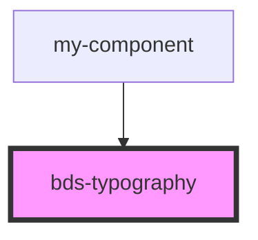

# bds-typography

<!-- Auto Generated Below -->

## Properties

| Property         | Attribute         | Description | Type                                                                                       | Default     |
| ---------------- | ----------------- | ----------- | ------------------------------------------------------------------------------------------ | ----------- |
| `element`        | `element`         |             | `"a" \| "div" \| "h1" \| "h2" \| "h3" \| "h4" \| "h5" \| "h6" \| "label" \| "p" \| "span"` | `'p'`       |
| `href`           | `href`            |             | `string`                                                                                   | `undefined` |
| `isDownloadable` | `is-downloadable` |             | `boolean`                                                                                  | `undefined` |
| `size`           | `size`            |             | `string`                                                                                   | `'md'`      |
| `target`         | `target`          |             | `"_blank" \| "_parent" \| "_self" \| "_top"`                                               | `undefined` |

## Dependencies

### Used by

 - [my-component](../my-component)

### Graph

----------------------------------------------

*Built with [StencilJS](https://stenciljs.com/)*
